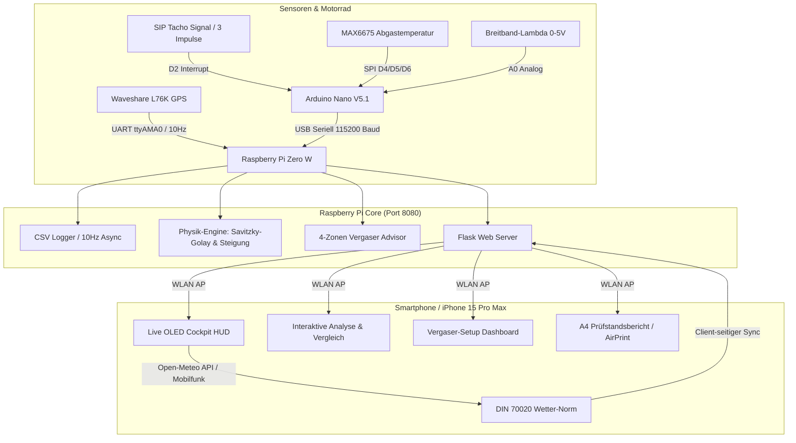

# 🛵 StreetDyno 2.0 – High-Precision Vespa Road Dyno & Telemetry System

[](https://www.raspberrypi.com/)
[-blue.svg)](https://platformio.org/)
[](https://flask.palletsprojects.com/)
[]()
[]()

**StreetDyno 2.0** ist ein mobiles Echtzeit-Telemetrie- und Leistungsmesssystem für klassische Vespa-Roller (Largeframe PX / VMC 177). Das System vereint hochfrequente Sensorik (RPM, AFR, EGT, GPS) mit physikalischer Fahrleistungsdynamik, automatischer Straßenneigungskompensation, 4-Zonen-Vergaserbedüsungsdiagnose und druckfertigen DIN 70020 Prüfstandsberichten.

---

## 📑 Inhaltsverzeichnis
1. [Systemarchitektur](#-systemarchitektur)
2. [Kernfunktionen](#-kernfunktionen)
3. [Physik- & Dyno-Engine](#-physik---dyno-engine)
4. [Dell'Orto / BGM SI 24/24 Jetting Advisor](#-dellorto--bgm-si-2424-jetting-advisor)
5. [Hardware & Pinbelegung](#-hardware--pinbelegung)
6. [Web Interface & Endpunkte](#-web-interface--endpunkte)
7. [Installation & Auto-Start](#-installation--auto-start)

---

## 🏗️ Systemarchitektur



---

## ⚡ Kernfunktionen

* 📱 **Live Cockpit HUD (Optimiert für iPhone 15 Pro Max)**:
  * Pitch-Black OLED Dark Mode für maximale Lesbarkeit bei direkter Sonneneinstrahlung am Lenker.
  * Dynamische Safe-Area-Freistellung für **Dynamic Island** und iOS Home-Bar.
  * Horizontale Drehzahlanzeige (0–10.000 U/min) mit **Shift-Light Blitz** ab 8.000 U/min.
  * Optischer Lean-AFR-Alarm (Blitzen bei AFR > 14.5 unter Last) und Abgastemperatur-Alarm (EGT $\ge 630^\circ	ext{C}$).
  * **Screen WakeLock API** (verhindert Standby beim Fahren) und One-Tap Start/Stop-REC-Button.

* 🔬 **Dell'Orto / BGM SI 24/24 Carburetor Jetting Advisor**:
  * Teilt jeden Dyno-Pull automatisch in 4 Vergaser-Betriebsbereiche ein (**ND**, **Schieber**, **Mischrohr/HLKD**, **HD**).
  * Liefert konkrete Bedüsungsempfehlungen (z.B. HD 135 $
ightarrow$ 138/140 bei Magerlauf).
  * Dediziertes Web-Dashboard ([`/tuning`](http://192.168.1.130:8080/tuning)) mit persistentem JSON-Speicher auf dem Pi.

* 🏔️ **GPS Straßenneigungs- & Hangabtriebskompensation**:
  * Physikalische Formel: $F_{	ext{slope}} = m \cdot g \cdot \sin	heta pprox m \cdot g \cdot s_{\%}$.
  * Dual-Modus: Automatische Höhen-Glättung via GPS oder manuelle Strecken-Presets (`0.0% Ebene`, `+0.8% Hausstrecke`, `+1.5% Bergauf`).
  * Eliminiert Bergauf-/Bergab-Verfälschungen vollständig aus den PS-Kurven.

* 🌤️ **DIN 70020 & SAE J1349 Wetter-Normierung (100% Offline-Sicher)**:
  * Der Pi bleibt im Fahrbetrieb komplett offline.
  * Das Smartphone zieht die exakten Wetterdaten (Temperatur, Luftdruck) per Mobilfunk über **Open-Meteo** anhand der GPS-Koordinaten aus dem Log.
  * Berechnet den Korrekturfaktor $k_{	ext{DIN}} = \left(rac{1013.25}{p}
ight) \cdot \sqrt{rac{T + 273.15}{293.15}}$.

* 📄 **Druckfähiger A4 Prüfstandsbericht (`/dyno_sheet`)**:
  * Offizieller Motorsport-Prüfstandsbericht mit Vektorkurven (Leistung, Drehmoment, AFR).
  * Vollständige Setup-Tabelle (Düsengrößen, Mischrohr, Auspuff, Gesamtgewicht).
  * Ein-Klick iOS Safari **"Als PDF sichern"** und AirPrint.

* 📊 **In-Browser Run-Vergleich (`/compare`)**:
  * Schneller Vergleich zweier Dyno-Runs mit interaktivem Chart.js Multi-Line-Overlay und $\Delta	ext{PS}$ / $\Delta	ext{Nm}$ Deltas.

---

## 📐 Physik- & Dyno-Engine

Die Berechnung der Rad- und Motorleistung basiert auf dem vollständigen fahrphysikalischen Kräftegleichgewicht:

$$F_{	ext{wheel}} = F_{	ext{acc}} + F_{	ext{aero}} + F_{	ext{roll}} + F_{	ext{slope}}$$

$$F_{	ext{wheel}} = (m \cdot k_{	ext{rot}}) \cdot a + rac{1}{2} 
ho \cdot c_w A \cdot v^2 + c_r \cdot m \cdot g + m \cdot g \cdot \sin	heta$$

$$P_{	ext{engine}} = rac{F_{	ext{wheel}} \cdot v}{\eta_{	ext{trans}}} \cdot k_{	ext{DIN}}$$

### Fahrzeug-Referenzkonfiguration (VMC 177 / Vespa PX):
| Parameter | Wert | Beschreibung |
|---|---|---|
| Gesamtmasse ($m$) | **190.0 kg** | 112 kg Vespa PX + 78 kg Fahrer |
| Massenfaktor ($k_{	ext{rot}}$) | **1.05** | Rotatorische Trägheit (Polrad, Kurbelwelle, Räder) |
| Abrollumfang ($U$) | **1.350 m** | Reifen 100/90-10 |
| Primärübersetzung | **2.957** | 23/68 Zähne |
| Getriebeübersetzung | **2.235** | 3. Gang (17/38 Zähne) $
ightarrow i_{	ext{total}} = 6.61$ |
| Luftwiderstand ($c_w A$) | **0.50 m²** | Fahrer leicht geduckt |
| Rollwiderstand ($c_r$) | **0.015** | Straßenreifen 2.2 bar |
| Getriebewirkungsgrad ($\eta$) | **0.90** | Schaltgetriebe & Primärtrieb |

---

## 🔬 Dell'Orto / BGM SI 24/24 Jetting Advisor

Der Vergaser-Berater wertet das gemessene Lambda/AFR in 4 Drehzahl- und Lastfenstern aus:

| Zone | Drehzahlbereich | Bauteil / Einfluss | Ziel-AFR | Diagnose & Auswirkung |
|---|---|---|---|---|
| **Zone 1** | 1.500 – 3.200 U/min | **Nebendüse (ND 60/160)** & Gemischschraube | **12.8 – 13.3** | Standgas, Ansprechverhalten & Schiebebetrieb |
| **Zone 2** | 3.200 – 4.800 U/min | **Gasschieber (Lemarxon Low)** Cutaway | **12.6 – 13.0** | Teillastübergang, verhindert Teillast-Magerklingeln |
| **Zone 3** | 4.800 – 6.500 U/min | **Mischrohr (x234)** & **HLKD (160)** | **12.5 – 12.9** | Vorzerstäubung beim Eintritt in die Auspuffresonanz |
| **Zone 4** | 6.500 – 9.000+ U/min | **Hauptdüse (HD 135)** | **12.4 – 12.8** | Volllast Spitzenleistung & thermischer Klemmschutz |

---

## 🔌 Hardware & Pinbelegung

### Arduino Nano V5.1
| Komponente | Arduino Pin | Funktion |
|---|---|---|
| **RPM Input (SIP Tacho Box)** | **D2** | Hardware Interrupt (RISING), 3 Impulse/Umdr. |
| **MAX6675 SO** | **D4** | SPI Serial Data Out (EGT Abgastemperatur) |
| **MAX6675 CS** | **D5** | SPI Chip Select |
| **MAX6675 SCK** | **D6** | SPI Serial Clock |
| **Lambda Controller (AFR)** | **A0** | Analog In (0–5V Breitband-Signal) |
| **Signal Masse** | **GND** | Gemeinsame Masse für Lambda & Sensoren |

### Raspberry Pi Zero W GPIO
| Komponente | Pi Pin (BCM) | Funktion |
|---|---|---|
| **OLED Display (SSD1306)** | **GPIO 2 / 3** | I2C SDA / SCL |
| **GPS Waveshare L76K** | **GPIO 14 / 15** | UART TX / RX (`/dev/ttyAMA0`) @ 9600 Baud |
| **Arduino Nano** | **USB** | Serieller Datenstrom (`/dev/ttyUSB0`) @ 115200 Baud |

---

## 🌐 Web Interface & Endpunkte

Das Flask-Webinterface läuft auf Port **8080** auf dem Raspberry Pi:

| Route / Endpunkt | Methode | Beschreibung |
|---|---|---|
| **`/`** | `GET` | Minimalistisches High-Contrast Live Cockpit HUD |
| **`/logs`** | `GET` | Aufgeräumtes Log-Archiv mit Multi-Select Vergleichs-Starter |
| **`/analyze?file=...`** | `GET` | P4-Dynokurve, Vergaser-Diagnose, Neigung & Wetter-Normierung |
| **`/compare?file1=...&file2=...`** | `GET` | Interaktiver 2-Run Kurvenvergleich mit Tooltips & Delta-Badges |
| **`/tuning`** | `GET` | Vergaser-Setup Formular & Live-Diagnose des letzten Pulls |
| **`/dyno_sheet?file=...`** | `GET` | Druckfertiger A4 Prüfstandsbericht für AirPrint & PDF-Export |
| **`/api/data`** | `GET` | Live JSON Telemetriestrom (RPM, Speed, AFR, EGT, GPS, Status) |
| **`/api/toggle_logging`** | `GET` | Startet / stoppt die CSV-Aufzeichnung per Tastendruck |
| **`/api/update_carb_setup`** | `POST` | Speichert geändertes Vergaser-Setup persistent in `user_setup.json` |

---

## 🛠️ Installation & Auto-Start

StreetDyno 2.0 startet automatisch beim Booten über einen systemd-Service:

```bash
# Service Status prüfen
systemctl status streetdyno.service

# Service neu starten
sudo systemctl restart streetdyno.service

# Live-Logs ansehen
journalctl -u streetdyno.service -f
```

---

## 👤 Autor & Lizenz
* **Entwickler**: Roland Bachmann ([@rolovsky](https://github.com/rolovsky))
* **Projekt**: StreetDyno 2.0 (V5.1 Master Edition)
* **Lizenz**: MIT License
