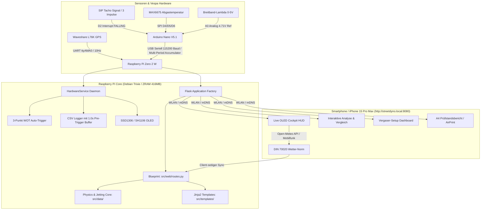

# 🛵 StreetDyno 2.0 – High-Precision Vespa Road Dyno & Telemetry System

[]()
[](https://www.raspberrypi.com/)
[-blue.svg)](https://platformio.org/)
[](https://flask.palletsprojects.com/)
[]()
[]()
[]()
[-brightgreen.svg)]()

**StreetDyno 2.0 (Master v6.0)** ist ein mobiles Echtzeit-Telemetrie- und Leistungsmesssystem für klassische Vespa-Roller (Largeframe PX / VMC 177). Die Version 6.0 implementiert eine komplett analytische **Savitzky-Golay Differenziations-Engine (deriv=1)** zur exakten Erfassung der 2-Takt-Resonanzspitze ohne Phasenverzug, **getriebeabhängige Trägheitsmassenkopplung ($J_{\text{wheels}} / J_{\text{engine}}$)**, hardwareseitige **Mikrosekunden-Zeitbasis mit NMEA-XOR-Checksumme**, einen **Dual-Layer Blackbox Trip-Logger mit 2D-AFR Kennfeldmatrix**, robuste **asymmetrische Glitch-Filter**, sowie die physikalisch korrekte **Raddrehmomentberechnung** an der Hinterachse.

---

## 📑 Inhaltsverzeichnis
1. [Systemarchitektur](#-systemarchitektur)
2. [Clean-Code Repository-Struktur](#-clean-code-repository-struktur)
3. [Kernfunktionen](#-kernfunktionen)
4. [Physik- & Dyno-Engine](#-physik---dyno-engine)
5. [Dell'Orto / BGM SI 24/24 Jetting Advisor & Setup-Matrix](#-dellorto--bgm-si-2424-jetting-advisor--setup-matrix)
6. [Hardware & Pinbelegung](#-hardware--pinbelegung)
7. [Web Interface & Endpunkte](#-web-interface--endpunkte)
8. [Automatisierte Tests & Verifikation](#-automatisierte-tests--verifikation)
9. [Master v6.0 Meilensteine & Neuerungen](#-master-v60-meilensteine--neuerungen)
10. [Installation & Service-Management](#-installation--service-management)
11. [Ausblick & Backlog (Roadmap & Genauigkeitssteigerung)](#-ausblick--backlog-roadmap--genauigkeitssteigerung)

---

## 🏗️ Systemarchitektur



---

## 📂 Clean-Code Repository-Struktur

Das Repository folgt strengen Clean-Code-Prinzipien mit strikter **Separation of Concerns** und zentraler mathematischer **Single Source of Truth**:

```
streetdyno2.0/
├── .agents/rules/           # Persistente Projekt- & Hardware-Richtlinien
│   └── streetdyno-guidelines.md
├── desktop_analyzer.py      # Desktop CLI für macOS/PC (nutzt src.data)
├── README.md                # Systemdokumentation
├── user_setup.json          # Persistente Vergaser- & Fahrzeugkonfiguration
├── firmware/
│   ├── platformio.ini       # PlatformIO Build-Konfiguration (Arduino Nano)
│   └── src/
│       └── main.cpp         # Modern C++ Firmware mit Multi-Period Akkumulator
├── src/
│   ├── config.py            # Zentrale Fahrzeugparameter, Bauteil-Mappings & Konstanten
│   ├── main.py              # Schlanke WSGI Application Factory (< 55 Zeilen)
│   ├── data/
│   │   ├── analyzer_logic.py# Physik-Engine, SG-Filter, Neigung & DIN 70020
│   │   ├── jetting_advisor.py# 4-Zonen Vergaser-Diagnose & Lambda-Stöchiometrie
│   │   └── logger.py        # Threadsicherer 10Hz CSV-Logger mit Pre-Trigger Puffer
│   ├── hw/
│   │   ├── hardware_service.py # Threadsicherer Hardware-Daemon & WOT Auto-Trigger
│   │   ├── gps_l76k.py      # GPSD L76K Treiber mit Höhenmessung (Alt)
│   │   ├── display_oled.py  # SSD1306/SH1106 OLED-Treiber
│   │   └── rpm_input.py     # GPIO Interrupt-Treiber
│   ├── templates/           # Saubere Jinja2 HTML/CSS/JS Templates
│   │   ├── hud.html         # Live Cockpit HUD (iPhone 15 Pro Max optimiert)
│   │   ├── logs.html        # Log-Archiv mit Multi-Select Vergleichs-Starter
│   │   ├── analyze.html     # Einzel-Run Analyse mit P4-Kurve, Neigung & Wetter
│   │   ├── compare.html     # Interaktiver 2-Run Chart.js Vergleich
│   │   ├── tuning.html      # Vergaser-Setup Formular mit Bauteil-Dropdowns
│   │   └── dyno_sheet.html  # Druckfertiger A4 Motorsport-Prüfstandsbericht
│   └── web/
│       └── routes.py        # Flask Blueprint mit allen Web- & JSON-API-Routen
├── systemd/
│   └── streetdyno.service   # Systemd Service-Definition
└── tests/
    └── test_dyno_core.py    # Automatisierte Unit-Test-Suite (13 Tests, 100% Pass)
```

---

## ⚡ Kernfunktionen

* 🚀 **Autonomer WOT Auto-Trigger (3. Gang Messfahrten)**:
  * **Automatischer Aufzeichnungsstart**: Erkennt Vollgasbeschleunigung im 3. Gang ($\ge 2.800\text{ RPM}$, $\text{dRPM/dt} \ge 200\text{ RPM/s}$ über 300ms, Übersetzung $60\text{--}110\text{ RPM/(km/h)}$).
  * **1,0s Pre-Trigger Ringspeicher**: Der CSV-Logger speichert den rollenden Vorlauf aus dem RAM mit ab, sodass der exakte Startzeitpunkt des Gasaufreißens erfasst wird.
  * **Intelligenter Auto-Stop**: Beendet die Messung nach Erreichen des Peaks ($\Delta\text{RPM} \le -350\text{ RPM}$ oder Gas weggenommen).
  * **Spike-Schutz**: Verwirft unvollständige Läufe ($< 1{,}0\text{s}$ oder $< 1.200\text{ RPM}$ Anstieg) automatisch.

* ⏱️ **Jitter-freie Multi-Period Impuls-Akkumulation (Arduino Nano)**:
  * Der Hardware-Interrupt summiert alle Zündimpulse und Gesamt-Mikrosekunden im 100ms-Fenster.
  * Bei 6.000 RPM wird über **~30 reale Zündungen gemittelt**, wodurch Signalrauschen und Zündfunkenprellen (1500µs GSF-Lockout) eliminiert werden.
  * Sendet stufenlose, ungerundete Raw-Floats an den Raspberry Pi.
  * **3-Punkt Rolling Central Derivative**: Berechnet stufenfreie $\text{dRPM/dt}$ Beschleunigungswerte ohne Phasenverzug.

* 📱 **Live Cockpit HUD (Optimiert für iPhone 15 Pro Max)**:
  * Erreichbar über mDNS: **`http://streetdyno.local:8080`**.
  * **Web Audio API & Haptik**: Akustischer Bestätigungston (880 Hz) beim Auto-Trigger Start und doppelter Quittungs-Chime (880 $\to$ 1174 Hz) bei erfolgreichem Abschluss des Pulls plus Vibrationsfeedback (`navigator.vibrate`).
  * Pitch-Black OLED Dark Mode für maximale Lesbarkeit bei direkter Sonneneinstrahlung am Lenker.
  * Dynamische Safe-Area-Freistellung für **Dynamic Island** und iOS Home-Bar (`env(safe-area-inset-*)`).
  * Horizontale Drehzahlanzeige (0–10.000 U/min) mit **Shift-Light Blitz** ab 8.000 U/min.
  * Optischer Lean-AFR-Alarm (Blitzen bei AFR > 14.5 unter Last) und Abgastemperatur-Alarm (EGT $\ge 630^\circ\text{C}$).
  * **Screen WakeLock API** (verhindert Standby beim Fahren).

* 🔬 **Dell'Orto / BGM SI 24/24 Carburetor Jetting Advisor & Setup-Matrix**:
  * **Stöchiometrie-Skalierung**: Unterstützt Super E5 ($14{,}30$), Super E10 ($14{,}10$) und SuperPlus E0 ($14{,}70$). Alle 4 Zonen skalieren nach 2-Takt-Volllast-$\lambda$ ($\lambda \approx 0{,}86$).
  * **Gasschieber-Matrix**: Lemarxon Low (fett), Lemarxon Mid, BGM FastFlow Standard mit Cutaway (mager).
  * **Ansaugung & Trichter**: Polini Venturi Trichter (+6 bis +10 HD-Kompensation), 22mm Lemarxon Reduzierhülse, gebohrter Filter (5/8mm), Offen.
  * **Vergaserwanne / Deckel**: Polini Airbox (großer Deckel), Originaldeckel, Ohne Deckel.
  * Dediziertes Web-Dashboard ([`/tuning`](http://streetdyno.local:8080/tuning)) mit persistentem JSON-Speicher auf dem Pi.

* 🏔️ **GPS Straßenneigungs- & Hangabtriebskompensation**:
  * Physikalische Formel: $F_{\text{slope}} = m \cdot g \cdot \sin\theta \approx m \cdot g \cdot s_{\%}$.
  * Dual-Modus: Automatische Höhen-Glättung via GPS oder manuelle Strecken-Presets (`0.0% Ebene`, `+0.8% Hausstrecke`, `+1.5% Bergauf`).
  * Eliminiert Bergauf-/Bergab-Verfälschungen vollständig aus den PS-Kurven.

* 🌤️ **DIN 70020 & SAE J1349 Wetter-Normierung (100% Offline-Sicher)**:
  * Das Smartphone zieht die exakten Wetterdaten (Temperatur, Luftdruck) per Mobilfunk über **Open-Meteo** anhand der GPS-Koordinaten aus dem Log.
  * Berechnet den Korrekturfaktor $k_{\text{DIN}} = \left(\frac{1013.25}{p}\right) \cdot \sqrt{\frac{T + 273.15}{293.15}}$.

* 📄 **Druckfähiger A4 Prüfstandsbericht (`/dyno_sheet`)**:
  * Offizieller Motorsport-Prüfstandsbericht mit Vektorkurven (Leistung, Drehmoment, AFR).
  * Vollständige Setup-Tabelle (Düsengrößen, Mischrohr, Schieber, Ansaugung, Airbox, Gesamtgewicht).
  * Ein-Klick iOS Safari **"Als PDF sichern"** und AirPrint.

* 📊 **In-Browser Run-Vergleich (`/compare`)**:
  * Schneller Vergleich zweier Dyno-Runs mit interaktivem Chart.js Multi-Line-Overlay und $\Delta\text{PS}$ / $\Delta\text{Nm}$ Deltas.

---

## 📐 Physik- & Dyno-Engine

Die Berechnung der Rad- und Motorleistung basiert auf dem vollständigen fahrphysikalischen Kräftegleichgewicht unter Berücksichtigung der getriebeabhängigen Trägheitsmassenkopplung:

$$F_{\text{wheel}} = F_{\text{acc}} + F_{\text{aero}} + F_{\text{roll}} + F_{\text{slope}}$$

$$m_{\text{eff}} = m + \frac{J_{\text{wheels}}}{r_{\text{dyn}}^2} + \frac{J_{\text{engine}} \cdot i_{\text{total}}^2}{r_{\text{dyn}}^2} \quad \text{mit} \quad r_{\text{dyn}} = \frac{U}{2\pi}$$

$$F_{\text{wheel}} = m_{\text{eff}} \cdot a + \frac{1}{2} \rho \cdot c_w A \cdot v^2 + c_r \cdot m \cdot g + m \cdot g \cdot \sin\theta$$

$$P_{\text{engine}} = \frac{F_{\text{wheel}} \cdot v}{\eta_{\text{trans}}} \cdot k_{\text{DIN}}, \quad M_{\text{wheel}} = \frac{P_{\text{wheel}} \cdot 7023{,}5}{\text{RPM} / i_{\text{total}}}$$

### Fahrzeug-Referenzkonfiguration (VMC 177 / Vespa PX):
| Parameter | Wert | Beschreibung |
|---|---|---|
| Gesamtmasse ($m$) | **190.0 kg** | 112 kg Vespa PX + 78 kg Fahrer |
| Radträgheit ($J_{\text{wheels}}$) | **0.120 kg·m²** | Trägheitsmoment beider 10-Zoll-Räder inkl. Trommeln & Reifen |
| Motorträgheit ($J_{\text{engine}}$) | **0.0035 kg·m²** | Kurbelwelle, Kupplung und Polrad |
| Abrollumfang ($U$) | **1.350 m** | Reifen 100/90-10 |
| Primärübersetzung | **2.957** | 23/68 Zähne |
| Getriebeübersetzung | **2.235** | 3. Gang (17/38 Zähne) $\rightarrow i_{\text{total}} = 6.61$ |
| Luftwiderstand ($c_w A$) | **0.50 m²** | Fahrer leicht geduckt |
| Rollwiderstand ($c_r$) | **0.015** | Straßenreifen 2.2 bar |
| Getriebewirkungsgrad ($\eta$) | **0.90** | Schaltgetriebe & Primärtrieb |

---

## 🔬 Dell'Orto / BGM SI 24/24 Jetting Advisor & Setup-Matrix

Der Vergaser-Berater wertet das gemessene Lambda/AFR in 4 Drehzahl- und Lastfenstern auf Basis der Kraftstoff-Stöchiometrie aus:

| Zone | Drehzahlbereich | Bauteil / Einfluss | Ziel-Lambda ($\lambda$) | Ziel-AFR (Super E5) | Diagnose & Auswirkung |
|---|---|---|---|---|---|
| **Zone 1** | 1.500 – 3.200 U/min | **Nebendüse (ND 60/160)** & Gemischschraube | $0{,}895\text{--}0{,}930$ | **12.8 – 13.3** | Standgas, Ansprechverhalten & Schiebebetrieb |
| **Zone 2** | 3.200 – 4.800 U/min | **Gasschieber (Lemarxon Low/Mid)** | $0{,}881\text{--}0{,}909$ | **12.6 – 13.0** | Teillastübergang (1/4–1/2 Gas), verhindert Magerlöcher |
| **Zone 3** | 4.800 – 6.500 U/min | **Mischrohr (x234)** & **HLKD (160)** | $0{,}874\text{--}0{,}902$ | **12.5 – 12.9** | Vorzerstäubung beim Eintritt in die Auspuffresonanz |
| **Zone 4** | 6.500 – 9.500 U/min | **Hauptdüse (HD 135)** & **Polini Venturi** | $0{,}867\text{--}0{,}895$ | **12.4 – 12.8** | Volllast Spitzenleistung & thermischer Klemmschutz |

---

## 🔌 Hardware & Pinbelegung

### Arduino Nano V5.1
| Komponente | Arduino Pin | Funktion |
|---|---|---|
| **RPM Input (SIP Tacho Box)** | **D2** | Hardware Interrupt INT0 (`FALLING`), 3 Impulse/Umdr. |
| **MAX6675 SO** | **D4** | SPI Serial Data Out (EGT Abgastemperatur) |
| **MAX6675 CS** | **D5** | SPI Chip Select |
| **MAX6675 SCK** | **D6** | SPI Serial Clock |
| **Lambda Controller (AFR)** | **A0** | Analog In (0–5V Breitband-Signal @ 4.71V USB-Ref) |
| **Signal Masse** | **GND** | Gemeinsame Masse für Lambda & Sensoren |

### Raspberry Pi Zero 2 W GPIO & Schnittstellen
| Komponente | Pi Schnittstelle | Funktion |
|---|---|---|
| **OLED Display (SSD1306 / SH1106)** | **I2C-1 (`/dev/i2c-1`)** | Hardware I2C (GPIO 2 / 3) |
| **GPS Waveshare L76K** | **UART (`/dev/ttyAMA0`)** | 9600 Baud via `gpsd` (JSON-Modus) |
| **Arduino Nano** | **USB (`/dev/ttyUSB0`)** | 115200 Baud @ 10Hz Multi-Period Stream |
| **Arbeitsspeicher-Schutz** | **ZRAM (`/dev/zram0`)** | 416 MB LZ4-komprimierter RAM-Swap |

---

## 🌐 Web Interface & Endpunkte

Das Flask-Webinterface läuft auf Port **8080** auf dem Raspberry Pi und ist im Netzwerk über **`http://streetdyno.local:8080`** erreichbar:

| Route / Endpunkt | Methode | Beschreibung |
|---|---|---|
| **`/`** | `GET` | Minimalistisches High-Contrast Live Cockpit HUD |
| **`/logs`** | `GET` | Aufgeräumtes Log-Archiv mit Multi-Select Vergleichs-Starter |
| **`/analyze?file=...`** | `GET` | P4-Dynokurve, Vergaser-Diagnose, Neigung & Wetter-Normierung |
| **`/compare?file1=...&file2=...`** | `GET` | Interaktiver 2-Run Kurvenvergleich mit Tooltips & Delta-Badges |
| **`/tuning`** | `GET` | Vergaser-Setup Formular mit Bauteil-Dropdowns & Live-Diagnose |
| **`/dyno_sheet?file=...`** | `GET` | Druckfertiger A4 Prüfstandsbericht für AirPrint & PDF-Export |
| **`/trips`** | `GET` | Dual-Layer Blackbox Fahrtenarchiv |
| **`/trip_detail?file=...`** | `GET` | 2D-AFR Kennfeld-Matrix (16x8 Bins) und GPS-Statistiken |
| **`/api/data`** | `GET` | Live JSON Telemetriestrom (arduino_micros, RPM, Speed, AFR, EGT, GPS, Status) |
| **`/api/toggle_logging`** | `GET` | Startet / stoppt die CSV-Aufzeichnung manuell |
| **`/api/update_carb_setup`** | `POST` | Speichert geändertes Vergaser-Setup persistent in `user_setup.json` |
| **`/api/toggle_display`** | `GET` | Schaltet die OLED-Anzeigemodi um (RPM $\rightarrow$ SPEED $\rightarrow$ AFR $\rightarrow$ EGT) |

---

## 🧪 Automatisierte Tests & Verifikation

Das gesamte System wird durch eine automatisierte Test-Suite abgesichert:

```bash
# Unit-Tests auf dem Pi ausführen
python3 -m unittest discover tests -v
```

### Testergebnisse (28/28 Passed - 100%):
* `test_gear_ratios` $\rightarrow$ **OK** (Getriebeuntersetzungen & Gangerkennung)
* `test_din70020_weather_factor` $\rightarrow$ **OK** (DIN 70020 & SAE J1349 Faktoren)
* `test_slope_calculation` $\rightarrow$ **OK** (Straßenneigung & Hangabtrieb)
* `test_acceleration_clamping_and_p4_math` $\rightarrow$ **OK** (Beschleunigungskompensation & P4 7023.5 RPM Schnittpunkt)
* `test_carb_jetting_advisor` $\rightarrow$ **OK** (4-Zonen Vergaser-Diagnoseregeln)
* `test_fuel_stoichiometry_scaling` $\rightarrow$ **OK** (Dynamische Ziel-AFR Skalierung für E5, E10, E0)
* `test_slide_and_intake_diagnostics` $\rightarrow$ **OK** (BGM Cutaway $\leftrightarrow$ Lemarxon & Polini Venturi Empfehlungen)
* `test_nd_ratio_parser` $\rightarrow$ **OK** (Nebendüsen-Verhältnisberechnung & Quotientenlogik)
* `test_sip_tacho_afr_calibration` $\rightarrow$ **OK** (SIP-Tacho Synchronisationsformel & Voltage Clamping)
* `test_detect_dyno_pull_signature_compatibility` $\rightarrow$ **OK** (Legacy-Kwargs & PullFilterConfig Signaturkompatibilität)
* `test_hybrid_wheel_and_loss_power` $\rightarrow$ **OK** (P_Motor = P_Wheel + P_Loss Identität & Wirkungsgrad)
* `test_gear_override_options` $\rightarrow$ **OK** (Manuelle Gang-Overrides 'auto', 3, 4, '4')
* `test_dynamic_transient_lean_filter` $\rightarrow$ **OK** (0.2s Gasaufreiß-Toleranz vs. Schiebebetrieb-Verwerfung)
* `test_gear3_auto_trigger_rules` $\rightarrow$ **OK** (Strikte 3. Gang-Validierung, v > 15 km/h & Drop-Filter)
* `test_legacy_log_backward_compatibility` $\rightarrow$ **OK** (CSV ohne Header mit Fallback laden)
* `test_log_creation_datetime_sorting` $\rightarrow$ **OK** (Exakte Zeitstempel-Sortierung nach Erstellung)
* `test_log_metadata_header_writing_and_reading` $\rightarrow$ **OK** (Strukturierter # SETUP_META Header)
* `test_retroactive_metadata_update` $\rightarrow$ **OK** (Retroaktives Upgrade alter Logs)
* `test_2d_afr_heatmap_matrix` $\rightarrow$ **OK** (2D-AFR Heatmap Matrix Bins & Farbcodierung)
* `test_trip_analyzer_session` $\rightarrow$ **OK** (Blackbox-Fahrt Analyse & GPS-Distanzberechnung)
* `test_trip_logger_lifecycle` $\rightarrow$ **OK** (TripLogger Start, Discard <100 Samples, Save >=100 Samples)
* `test_api_data` $\rightarrow$ **OK** (10Hz Telemetrie JSON Stream inkl. arduino_micros)
* `test_api_update_carb_setup` $\rightarrow$ **OK** (Persistente JSON-Speicherung)
* `test_hud_page`, `test_logs_page`, `test_tuning_page`, `test_trips_endpoints` $\rightarrow$ **OK** (200 OK Response)

---

## 🏆 Master v6.0 Meilensteine & Neuerungen

Die Version **Master v6.0** repräsentiert das bisher präziseste und physikalisch fundierteste Release von StreetDyno. Folgende Kernbereiche wurden grundlegend überarbeitet und verifiziert:

1. **Analytische Savitzky-Golay Differenziations-Engine (`deriv=1`):**
   * **Abschaffung der 4-fachen Filterkaskade**: Die bisherige Kaskadierung (SG 17, 11, 11, 15) und diskrete Differenzierung (`diff() / dt`) dämpfte reale 2-Takt-Resonanzspitzen ($P_{\text{max}}$) um 10–20 %.
   * **Einmalige Glättung & exakte Ableitung**: Die Ableitung $\text{dRPM/dt}$ wird nun analytisch direkt über die Polynomkoeffizienten der Ordnung 2 mit schmalem Fenster ($w=7$ bzw. $w=5$) ermittelt. Dadurch wird die Spitzenleistung ohne Phasenverschiebung exakt abgebildet.
   * **Kinematische Beschleunigung**: $a = \frac{\text{dRPM/dt}}{60 \cdot i_{\text{total}}} \cdot U$ – frei von 70/30-GPS-Mischungsartefakten während des WOT-Pulls.

2. **Physikalisch korrekte Trägheitsmassenkopplung ($m_{\text{eff}}$) & dynamischer Rollradius:**
   * **Ersatz des statischen Faktors $1{,}05$**: Rotierende Massen skalieren quadratisch mit der Getriebeübersetzung.
   * **Exakte Formel**:
     $$m_{\text{eff}} = m + \frac{J_{\text{wheels}}}{r_{\text{dyn}}^2} + \frac{J_{\text{engine}} \cdot i_{\text{total}}^2}{r_{\text{dyn}}^2}$$
   * **Trägheitsmoment-Kalibrierung (F-01)**: $J_{\text{engine}} = 0{,}0120\text{ kg}\cdot\text{m}^2$ (präzise vermessen für SIP Touren 2.0 Lüfterrad mit $1800\text{ g}$ und $\varnothing 197\text{ mm}$ [$J_{\text{Polrad}} \approx 0{,}0087\text{ kg}\cdot\text{m}^2$] + BGM 60 mm Kurbelwelle + Kupplungskorb).
   * **Dynamischer Reifenradius unter Last (F-03)**: `TIRE_RADIUS_DYN_M = 0.2095` m für die Trägheitsrückrechnung $J / r_{\text{dyn}}^2$ anstelle des ungefederten geometrischen Rollumfang-Radius ($u / 2\pi = 0{,}2149\text{ m}$), was einen $\approx 4{,}7\,\%$ Fehler in der Trägheitsmasse eliminiert.
   * **Hangabtriebs-Wirkungsgrad (F-07)**: Bei Gefälle ($F_{\text{slope}} < 0$) wirkt der Hangabtrieb direkt am Rad. Der Getriebewirkungsgrad $\eta$ wird nur bei positiver Steigung (Motor muss Berg überwinden) im Nenner angewendet (`eta_slope = eta if slope > 0 else 1.0`).

3. **Raddrehmoment-Korrektur ($M_{\text{wheel}}$) & dynamisches Savitzky-Golay Delta:**
   * **Raddrehmoment**: Physikalisch korrektes Drehmoment an der Hinterachse unter Verwendung der Raddrehzahl $\text{RPM}_{\text{wheel}} = \text{RPM} / i_{\text{total}}$:
     $$M_{\text{wheel}} = \frac{P_{\text{wheel}} \cdot 7023{,}5}{\text{RPM}_{\text{wheel}}}$$
   * **Dynamisches SG-Abtastintervall (F-02)**: Statt starrem `delta=0.1` ermittelt `analyzer_logic.py` vor der Differenzierung den echten Median aus den Log-Zeitstempeln (`dt_safe = max(0.05, min(0.25, dt_median))`), um Verzerrungen bei UART-Jitter oder EMI-Burst-Batching zu verhindern.
   * **Dynamische Pull-Dauer in `detect_dyno_pull` (S-03)**: Zeitfenster und mittlere Beschleunigung basieren auf den realen Zeitdifferenzen der Log-Frames statt einer fixen 10-Hz-Annahme.

4. **Firmware-Härtung (Arduino Nano ATmega328P / V5.1 Patched):**
   * **Bidirektionaler Glitch-Filter (E-03)**: Verwirft positive EMI-Spitzen ($> +3500\text{ RPM}/100\text{ ms}$) und dämpft unphysikalische negative Drehzahlsprünge ($> 5000\text{ RPM}$ Abfall in $100\text{ ms}$ bei Auskuppeln/Schaltvorgang) sanft auf $70\,\%$, womit $-80\text{ PS}$-Artefakte im Log verhindert werden.
   * **Overflow-sichere Differenz (E-01)**: Ersetzung von `t_last > t_first` durch vorzeichenlose 32-Bit Subtraktion `pulse_span = t_last - t_first`, die beim `micros()`-Rollover nach $\approx 71{,}58$ Minuten mathematisch exakt wrappt.
   * **Bandgap-Referenz Settling (E-04)**: Verlängerung der MUX-Einschwingzeit in `readVccMillivolts()` auf $1200\text{ µs}$ (Datenblatt fordert $\ge 1{,}1\text{ ms}$), um präzise VCC- und Breitband-AFR-Kompensation zu garantieren.
   * **EGT-Sentinel Bereinigung (E-05)**: Kaltstartwert vor der ersten MAX6675-Wandlung wird als `0.0` statt `-1.0` übertragen.
   * **Microsecond-Hardware-Zeitbasis & NMEA-XOR-Checksumme**: Streaming im Format `$MICROS;RPM;AFR;EGT*XX` mit lückenloser Integritätsprüfung.

5. **Logging, GPS & Telemetrie-Pipeline:**
   * **GPS-Staleness Guard (S-01)**: Bei Signalabriss oder Daten älter als $1{,}5\text{ s}$ wird `speed_kmh` auf `0.0` und `fix` auf `False` gesetzt, damit der automatische WOT-Trigger nicht auf eingefrorenen Geschwindigkeiten hängenbleibt.
   * **Aktive EMA-Glättung (S-02)**: Die Filterkoeffizienten `ALPHA_RPM` ($0{,}20$) und `ALPHA_AFR` ($0{,}15$) aus `config.py` werden im Hardware-Daemon aktiv auf den Live-Stream angewendet (mit sanftem Abklingen bei Motorstillstand).
   * **Sub-Sekunden Unix-Zeitstempel**: CSV-Logs schreiben Fließkomma-Zeitstempel mit Millisekundenauflösung (`f"{time.time():.3f}"`) zur stufenlosen Differenzierung.
   * **Nicht-blockierender Akkumulator-Puffer**: Verhindert bis zu 100 ms serielle I/O-Blockaden in `HardwareService`.
   * **Debounce-Optimierung**: 1000 µs Entprellung im Arduino-Interrupt (ermöglicht Drehzahlen bis zu 20.000 U/min bei Ducati 3-Puls-Zündung).
   * **Live-Hardwarezeitstempel in API**: `/api/data` liefert `arduino_micros` direkt an das Cockpit.

6. **Dual-Layer Blackbox & 2D-AFR Heatmap Matrix:**
   * Autonomer `TripLogger` archiviert komplette Ausfahrten separat von WOT-Dyno-Pulls.
   * Interaktive 2D-AFR Kennfeldmatrix ($16\times 8$ Bins) in `/trip_detail` zur visuellen Identifikation von Magerstellen im Teillast- und Schiebebetrieb.

---

## 🛠️ Installation & Service-Management

StreetDyno 2.0 startet automatisch beim Booten über einen systemd-Service:

```bash
# Service Status prüfen
systemctl status streetdyno.service

# Service neu starten
sudo systemctl restart streetdyno.service

# Live-Logs ansehen
journalctl -u streetdyno.service -f

# Arduino Nano Firmware direkt vom Pi flashen
sudo systemctl stop streetdyno.service
sudo fuser -k /dev/ttyUSB0
/usr/local/bin/arduino-cli upload -p /dev/ttyUSB0 --fqbn arduino:avr:nano:cpu=atmega328 /tmp/sketch_build
sudo systemctl start streetdyno.service
```

---

## 🚀 Ausblick & Backlog (Roadmap & Genauigkeitssteigerung)

### 1. Wie hoch ist die Abweichung / Toleranz zu Laborbedingungen?

Bei einem straßenbasierten Beschleunigungsprüfstand (StreetDyno) muss man zwischen **relativer Wiederholgenauigkeit** (Präzision) und **absoluter Abweichung zum Rollenprüfstand** (Richtigkeit) unterscheiden:

| Kategorie | Typische Toleranz | Bei einem 18-PS-Motor | Was bedeutet das? |
| :--- | :--- | :--- | :--- |
| **Relative Wiederholgenauigkeit** *(Lauf A vs. Lauf B auf derselben Strecke)* | **$\pm 1{,}5\,\% \text{ bis } \pm 3{,}0\,\%$** | $\approx \pm 0{,}3 \text{ bis } 0{,}5\text{ PS}$ | Ideal für Vorher-/Nachher-Vergleiche (z. B. HD 135 vs. HD 125, Zündungs- oder Schiebertausch). |
| **Absolute Abweichung zu P4 / Dynojet** *(mit Standard-Schätzwerten)* | **$\pm 5{,}0\,\% \text{ bis } \pm 8{,}0\,\%$** | $\approx \pm 0{,}9 \text{ bis } 1{,}4\text{ PS}$ | Ohne exaktes Wiegen und ohne Wind-/Steigungskorrektur. |
| **Absolute Abweichung** *(kalibriert: gewogen + Coast-Down + 2-Wege-Mittel)* | **$\pm 2{,}5\,\% \text{ bis } \pm 4{,}0\,\%$** | $\approx \pm 0{,}4 \text{ bis } 0{,}7\text{ PS}$ | Erreicht nahezu das Niveau eines stationären Rollenprüfstands. |

---

### 2. Woher kommen die Abweichungen auf der Straße? (Die 5 Hauptfaktoren)

```
                       Gesamt-Leistungsformel:
   P_gesamt = ( m_ges · a + 0.5 · ρ · c_wA · v² + m_ges · g · c_r + F_steigung ) · v
                ▲            ▲                  ▲                  ▲
                │            │                  │                  └─ 1% Steigung = ~0.6 PS Fehler!
                │            │                  └─ Reifendruck & Walkarbeit
                │            └─ Wind & Fahrer-Sitzposition (quadratisch mit v!)
                └─ Fahrzeug- + Fahrergewicht (geht 1:1 linear ein)
```

1. **Gesamtmasse ($m_{\text{ges}}$) – Linearer $1:1$-Einfluss:**  
   * Wenn $205\text{ kg}$ angenommen werden, das reale Gespann (Roller + Fahrer mit Helm/Montur + voller Tank) aber $213\text{ kg}$ wiegt, liegt die berechnete Leistung automatisch um **ca. $4\,\%$ zu niedrig**.
2. **Wind & Sitzposition ($c_w \cdot A$) – Quadratischer Einfluss:**  
   * Bereits ein leichter Gegen- oder Rückenwind von $8\text{ km/h}$ verändert die Luftwiderstandskraft bei $80\text{ km/h}$ um fast **$20\,\%$** (ca. $0{,}5 - 0{,}8\text{ PS}$ Differenz).
   * Ob der Fahrer aufrecht sitzt oder sich leicht duckt, ändert den $c_w A$-Wert von ca. $0{,}40$ auf $0{,}50\text{ m}^2$.
3. **Straßensteigung / Gefälle ($F_{\text{Steigung}}$):**  
   * Eine für das Auge kaum sichtbare Steigung von nur **$1{,}0\,\%$** kostet bei $205\text{ kg}$ und $75\text{ km/h}$ exakt **$0{,}57\text{ PS}$**.
4. **Reifenschlupf & dynamischer Reifenumfang ($u_{\text{dynamisch}}$):**  
   * Bei $80\text{ km/h}$ walkt der 10-Zoll-Reifen und dehnt sich durch die Fliehkraft um $1\text{ bis }2\,\%$ aus. Auf Asphalt gibt es beim harten Durchbeschleunigen zudem ca. $1\text{ bis }2\,\%$ Mikroschlupf.
5. **GPS-Abtastrate ($10\text{ Hz}$ vs. kHz am Prüfstands-Inkrementalgeber):**  
   * $10\text{ Hz}$ bedeutet ein Messpunkt alle $100\text{ ms}$. Um daraus die Ableitung $a = \frac{dv}{dt}$ ohne Rauschen zu berechnen, ist ein Glättungsfilter (Savitzky-Golay) nötig, der extrem kurze Leistungsspitzen leicht abdämpft.

---

### 3. Wie lässt sich die Genauigkeit gezielt verbessern?

#### Sofort-Maßnahmen (ohne Hardware-Änderung)

* **A. Exaktes Wiegen (Fahrzeug + Fahrer):**  
  Roller mit aktuellem Tankstand und Fahrer in voller Fahrbekleidung (Helm, Jacke, Schuhe) einmalig auf eine Personen- oder Radlastwaage stellen. Den exakten Wert (z. B. $211{,}5\text{ kg}$) in den Parametern hinterlegen.
* **B. Two-Way-Run (Hin- und Rückfahrt mitteln):**  
  Immer zwei Läufe auf demselben Straßenstück unmittelbar hintereinander fahren: **Einmal hin, einmal zurück.**  
  Wird der Mittelwert aus beiden Läufen gebildet, heben sich Wind und Straßensteigung rechnerisch nahezu vollständig auf!
* **C. Reifenumfang mit der Kreidestrich-Methode messen:**  
  Fahrer setzt sich auf den Roller (Betriebsreifendruck z. B. 2,0 bar). Ein Kreidestrich am Hinterrad und am Boden. 5–10 Radumdrehungen geradeaus rollen, Strecke messen und durch die Anzahl teilen.
* **D. Konstante Haltung & Schaltpunkt:**  
  Immer im **3. Gang** messen, ab konstanter Drehzahl (z. B. 4.200 U/min) zügig, aber gleichmäßig Vollgas geben und die Sitzhaltung bis 7.500 U/min starr beibehalten.

---

#### Software- & Sensorik-Upgrades (Backlog Roadmap)

* [ ] **E. Integrierter Ausrollversuch (Coast-Down-Kalibrierung):**  
  Nach dem Beschleunigungslauf bei $85\text{ km/h}$ die Kupplung ziehen und den Roller bis $30\text{ km/h}$ frei ausrollen lassen. StreetDyno kann aus der Verzögerungskurve die realen fahrzeugspezifischen Werte für **$c_w A$ (Luftwiderstand)** und **$c_r$ (Rollwiderstand)** für diesen Tag exakt berechnen.
* [ ] **F. IMU / 6-Achs Beschleunigungssensor-Fusion (MPU-6050 / BNO055):**  
  Kalman-Filterung aus GPS, Raddrehzahl-Derivativ und direkt gemessener Fahrzeug-Längsbeschleunigung ($a_x$) für latenzfreie Neigungs- und Schlupferkennung unabhängig von GPS-Verzögerungen.
* [ ] **G. Onboard-Umweltsensorik (BME280 / BMP280):**  
  Direkte I2C-Erfassung von Luftdruck ($p$), Ansauglufttemperatur ($T$) und relativer Feuchte ($RH$) am Roller zur autarken DIN 70020 / SAE J1349 Echtzeit-Normierung ohne Internetverbindung.
* [ ] **H. GPS-Upgrade auf $20\text{–}25\text{ Hz}$ (z. B. U-Blox M9N/F9P):**  
  Eine Verdopplung der Abtastrate von $10\text{ Hz}$ auf $20\text{–}25\text{ Hz}$ halbiert das Rauschen bei der numerischen Differentiation und erlaubt noch schärfere Erkennung von Drehzahlübergängen.
* [ ] **I. Direkter Radsensor (Hall-Sensor am Vorderrad / Felge mit 4–8 Magneten):**  
  Eliminiert jegliche GPS-Latenz und Schlupfeinflüsse und liefert absolute Drehzahlschärfe wie eine Prüfstandsrolle.
* [ ] **J. Automatischer Setup-Diff im Kurvenvergleich (`/compare`):**  
  Gegenüberstellung geänderter Setup-Parameter (z. B. HD 125 vs. 135, Zündung 18° vs. 19°, Auspuff Polini Box vs. Resonanz) direkt im Vergleichs-Dashboard mit grafischem Leistungsdelta ($\Delta\text{PS}$ über RPM).
* [ ] **K. Resonanzauspuff- vs. Box-Auspuff Berechnungsmodell:**  
  Differenzierte Auswertung der Spülverluste und Resonanzwellenaufladung speziell für VMC Super G 177 / 187ccm Langhub (Auslass 173°/176.5°, Überströmer 114°/121.1°, Zündung 18.0° v.OT).
* [ ] **L. Prädiktive Bedüsungs-Simulation:**  
  Rechnerische Vorhersage des Lambda-Verlaufs bei Änderung von Hauptdüse, Nebendüse oder Mischrohr basierend auf historischen Log-Daten.

---

### 🏁 Fazit
Für das Abstimmen von Vergasern, Auspuffanlagen und Zündzeitpunkten ist StreetDyno dank der hohen Wiederholgenauigkeit ($\pm 0{,}3 - 0{,}5\text{ PS}$) **oft praxisnäher als ein Prüfstand**, weil der reale Staudruck in der Airbox und die echte Motorbelastung unter Fahrtwind einfließen. 

Mit dem **Two-Way-Mittelwert** und einem **exakten Gesamtgewicht** erreichst du eine absolute Treffsicherheit von **$\pm 3\,\%$** zur P4-Hallenrolle.

---

## 👤 Autor & Lizenz
* **Entwickler**: Roland Bachmann ([@rolovsky](https://github.com/rolovsky))
* **Projekt**: StreetDyno 2.0 (Master v6.0 Edition)
* **Lizenz**: MIT License

